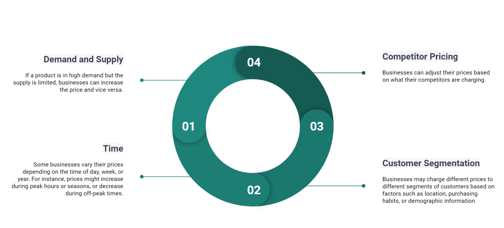

# Dynamic Pricing Dataset
# Maximize revenue and profitability by dynamic pricing

## About Dataset

A ride-sharing company is aiming to optimize its fare system by implementing a **dynamic pricing strategy** that responds to real-time market conditions. Historically, the company has used only ride duration to determine fares. Now, the goal is to utilize data-driven techniques to analyze historical ride data and develop a predictive model. This model will dynamically adjust prices based on various factors.

### Dataset Overview

The provided dataset includes historical data with the following features:

- **Number of Riders**: Total riders per trip.
- **Number of Drivers**: Available drivers at the time of booking.
- **Location Category**: Classification of the pickup location.
- **Customer Loyalty Status**: Indicates if a customer belongs to a loyalty program.
- **Number of Past Rides**: Total completed rides by the customer.
- **Average Ratings**: Average rating given to drivers by customers.
- **Time of Booking**: When the ride was booked.
- **Vehicle Type**: Type of vehicle used for the ride.
- **Expected Ride Duration**: Estimated time for the ride.
- **Historical Cost of the Rides**: Past fare for similar rides.

### Objective

Your task is to build a **dynamic pricing model** that incorporates these features to predict optimal fares for rides in real-time. The model must consider demand patterns and supply availability to make accurate fare predictions.

Features:

- `Number_of_Riders`
- `Number_of_Drivers`
- `Location_Category`
- `Customer_Loyalty_Status`
- `Number_of_Past_Rides`
- `Average_Ratings`
- `Time_of_Booking`
- `Vehicle_Type`
- `Expected_Ride_Duration`
- `Historical_Cost_of_Ride`

### References

1. [Dynamic Pricing Explained: Use in Revenue Management and Pricing Optimization](https://www.altexsoft.com/blog/dynamic-pricing-explained-use-in-revenue-management-and-pricing-optimization/)
2. [Dynamic Pricing Using Reinforcement Learning and Neural Networks](https://towardsdatascience.com/dynamic-pricing-using-reinforcement-learning-and-neural-networks-cc3abe374bf5)
3. [arXiv Paper on Dynamic Pricing](https://arxiv.org/abs/1912.02572)
4. [Neural Networks - Uber Blog](https://www.uber.com/en-IN/blog/neural-networks/)
5. [Dynamic-pricing-dataset](https://www.kaggle.com/datasets/arashnic/dynamic-pricing-dataset/data/)
